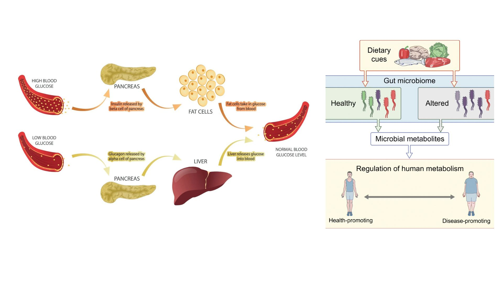

# Personalized Nutrition Recommender

Today, countless diet plans are available, yet most fail to deliver lasting results because they overlook two critical factors: individual preferences and biological differences. Every person’s biology is unique, influencing how they respond to different foods and diets. Standardized diet plans often lead to poor adherence and ineffective outcomes without considering these personal variations. This highlights the growing need for a personalized nutrition solution that tailors recommendations based on each individual's biological and lifestyle factors.

## How Glucose, Macronutriments, and Gut Health Affect Weight Gain



Weight gain is strongly influenced by how the body processes glucose from carbohydrates. When we eat carb-heavy meals, blood glucose levels rise. If these spikes are too high or frequent, the body releases more insulin to store the excess glucose as fat, leading to gradual weight gain.

Balanced meals — combining carbohydrates with fiber, proteins, and healthy fats — help slow glucose absorption, preventing sharp spikes and reducing fat storage.
Gut health also plays a critical role: a healthy gut microbiome supports efficient metabolism, while an imbalanced microbiome can promote fat accumulation and metabolic dysfunction.

Importantly, scientific studies have shown that reducing and regulating glucose spikes is an effective, proven strategy for promoting fat loss and improving overall metabolic health.

## Solution Overview

Our Solution: Personalized Nutrition Analysis
Recognizing the limitations of generic diet plans and the critical role of glucose regulation, gut health, and clinical factors in weight management, we have developed a system specifically designed to address these challenges.
Our solution analyzes meal logs to evaluate macronutrients, sugar risk, and carb load, while also integrating microbiome test results to understand how gut bacteria influence metabolism. Additionally, clinical data such as fasting glucose, insulin levels, BMI, and lifestyle factors are considered to generate personalized nutrition insights.

## System Architecture

Our system is built using a **microservices architecture**, where each major function operates as an independent service.  
These services are **containerized using Docker** to ensure modularity, scalability, and easier deployment.  
Each service communicates through the **Nutrition Controller (API Gateway)** to coordinate the system.

The main services include:

1. **Food Analyzer**  
   This microservice uses a **food item recognition model** provided by **Clarifai AI**.  
   It takes a meal image as input and returns a list of predicted ingredients present in the image.  
   If the confidence score of the identified ingredients is low, the system prompts the user to provide an optional meal description to enhance prediction quality.

2. **Nutrition Predictor**  
   This service estimates the **macronutrient composition** (carbohydrates, protein, and fat) of a meal.  
   The prediction process is divided into two steps:
   - **First**, the extracted ingredients (and optionally the user-provided description) are processed.
   - **Second**, the combined input is passed to a **ChatGPT-based model**, which interprets the meal details and predicts the macronutrient distribution in percentage form.  
   
   This two-step approach helps **reduce prediction error** by focusing on proportionality rather than absolute values.  
   Additionally, it predicts the **refined carbohydrate content** and **sugar risk** of the meal.

3. **Microbiome Analyzer**  
   Processes user **microbiome test results** to extract features related to **gut health**, **metabolism**, and **glucose regulation**.

4. **Glucose Monitor**  
   Predicts the **personalized glucose response** to meals by integrating food analysis, microbiome data, and clinical features such as **fasting glucose** and **insulin levels**.

5. **User Interface (Frontend)**  
   A modern **web application** where users can upload meal images, view glucose predictions, and receive **personalized dietary recommendations**.

## Dataset

To develop our system, we used the publicly available **CGM Macros Dataset** from PhysioNet ([link](https://physionet.org/content/cgmacros/1.0.0/)).

The dataset consists of data collected from a study on **45 participants**, and includes:

- **Meal Logs**:  
  Food pictures and timestamps for each meal consumed by the participants.

- **Microbiome Data**:  
  Information on gut bacteria presence or absence, providing insights into each participant's microbiome profile.

- **Clinical Data**:  
  Demographic and clinical features such as age, gender, weight, height, BMI, fasting insulin, and fasting glucose levels.

- **Continuous Glucose Monitoring (CGM) Data**:  
  Glucose levels recorded every minute, allowing us to precisely link meal intake to glucose spikes over time.

This dataset enables the simulation of a real-world personalized nutrition system by linking meal composition, gut health, clinical markers, and glucose response.  
It serves as a strong foundation for testing our models and validating the personalized prediction of glucose spikes based on food intake and biological data.

## Database Schema

The system uses PostgreSQL with the following tables:
- `user_profile`: User authentication and profile information
- `meal_log`: History of analyzed meals and predictions
- `microbiome_data`: User microbiome test results
- `clinical_user_data`: User health metrics (BMI, glucose levels, etc.)

## Getting Started

### Prerequisites
- Docker and Docker Compose
- API keys for external services (Clarifai, OpenAI, etc.)

### Environment Configuration
Create a `.env` file with the following variables

DB_HOST
DB_NAME
DB_USER
DB_PASSWORD
DB_PORT
CLARIFAI_PAT
CLARIFAI_USER_ID
CLARIFAI_APP_ID
OPENAI_API_KEY
AWS_ACCESS_KEY_ID
AWS_SECRET_ACCESS_KEY

avaible as github secrets in our repository.
```

### Running the Application
```bash
docker-compose up
```

The application will be available at http://localhost:8000, with the UI at http://localhost:3000.

## Using the Different Services

### Analyze a Meal
After navigating to the analyze meal page the user should first input a meal photo by either dragging and dropping or by browsing through the device and selecting an image of type .jpg or .png after inputing the user selects a meal category then presses the Analyze Meal button to get the results if the image not clear error is displayed then the user must enter a brief description to help the model asses the meal image accuratly.

### Predict Glucose Response
In the first section of the Glucose Response Predictor the user should input his clinical data and microbiome data both are .csv files then proceeds to the next section by pressing Next, the user is then required to follow a similar procedure to the Analyze Meal functionality, then the user presses Complete prediction to view the predicted glucose spike after 60 minutes.

### Gut Health Analyzer
The user enters his microbiome data as a .csv file and then presses Analyze Gut Health, and then the predicted gut health should be outputed and if the gut health is bad a small recomendation on how to improve it is also displayed.

## Architecture Diagram

```

┌───────────────────┐     ┌─────────────────┐
│    UI Frontend    │◄────┤ API Gateway     │
└───────────────────┘     │(NutritionController)
                          └────────┬────────┘
                                  ▲│▲
                  ┌───────────────┘│└──────────────┬──────────────┐
                  │                │               │              │
        ┌─────────▼────────┐ ┌─────▼─────────┐ ┌───▼────────┐ ┌──▼──────────┐
        │   Food Analyzer  │ │ Nutrition     │ │ Microbiome │ │ Glucose     │
        │                  │ │ Predictor     │ │ Analyzer   │ │ Monitor     │
        └──────────────────┘ └───────────────┘ └────────────┘ └─────────────┘
                  │                │               │              │
                  └────────────────┴───────────────┴──────────────┘
                                       │
                                   ┌───▼───┐
                                   │ DB    │
                                   └───────┘
```

## Monitoring

The system includes Prometheus metrics and a Grafana dashboard for monitoring:
- Request counts
- Latency metrics
- Prediction values
- Service health

## Troubleshooting

Common issues:
- **Column name mismatches**: Ensure CSV files for clinical/microbiome data use the expected column names (`clinical_Age`, `clinical_Weight`, etc.)
- **Service connectivity**: Check that all services can communicate with each other
- **Database connection**: Verify database credentials and connection parameters
